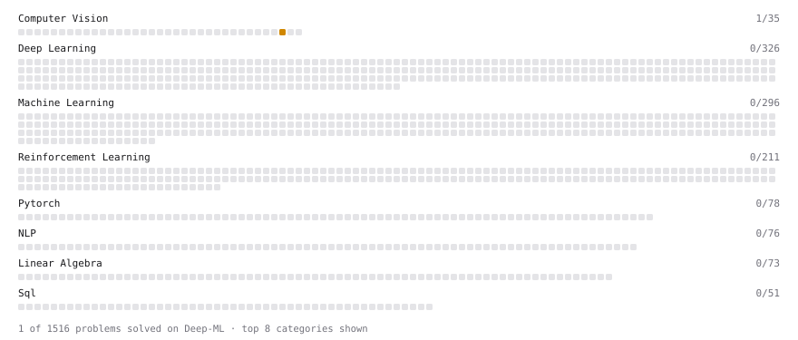

# Deep-ML

My machine learning practice from [Deep-ML](https://www.deep-ml.com). Every solution here was written by hand.

**8** solved · 8 problems · 0 labs · 0 math

[**Browse the interactive portfolio**](https://THEN01EXPLORER.github.io/deep-ml/) to replay this filling in over time.

## Problems

| | Difficulty | Solved | |
| --- | --- | --- | --- |
| [Random Rotation Matrix and a Rotation Layer](https://www.deep-ml.com/problems/1190) | easy | 2026-10-05 | [solution](problems/1190-random-rotation-matrix-and-a-rotation-layer) |
| [Analyze Singular Value Spectrum to Determine Intrinsic Rank](https://www.deep-ml.com/problems/876) | medium | 2026-10-03 | [solution](problems/0876-analyze-singular-value-spectrum-to-determine-intrinsic-rank) |
| [Anchor Matching via IoU Assignment](https://www.deep-ml.com/problems/1253) | medium | 2026-10-02 | [solution](problems/1253-anchor-matching-via-iou-assignment) |
| [Calculate AUC (Area Under ROC Curve)](https://www.deep-ml.com/problems/277) | medium | 2026-10-09 | [solution](problems/0277-calculate-auc-area-under-roc-curve) |
| [Dynamic Programming Drills: Knapsack and Grid Paths](https://www.deep-ml.com/problems/1149) | medium | 2026-10-07 | [solution](problems/1149-dynamic-programming-drills-knapsack-and-grid-paths) |
| [Power Users With Purchases in Every Month of the Year](https://www.deep-ml.com/problems/1462) | medium | 2026-10-06 | [solution](problems/1462-power-users-with-purchases-in-every-month-of-the-year) |
| [Queue from Two Stacks and a Min-Stack](https://www.deep-ml.com/problems/1147) | medium | 2026-10-08 | [solution](problems/1147-queue-from-two-stacks-and-a-min-stack) |
| [Resource Dilation Factor for Scheduling](https://www.deep-ml.com/problems/623) | medium | 2026-10-04 | [solution](problems/0623-resource-dilation-factor-for-scheduling) |

---

_This file is regenerated by Deep-ML on every push._
